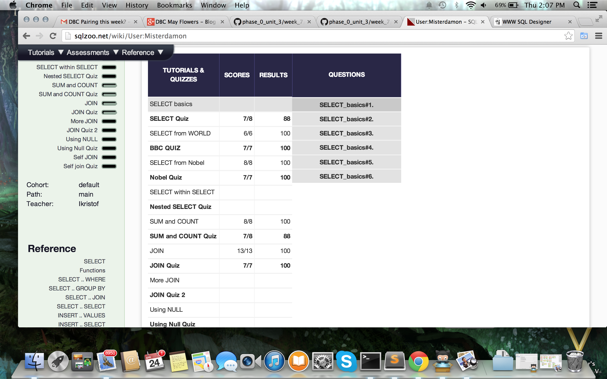

## U3.W7: SQLZoo

####I worked on this challenge by myself.

### My Quiz Results:
<!-- Include the link to your image (saved in the imgs folder) to display it inline. -->

### Reflection
* For the SQLzoo challenge, it was really great to get experience with SQL queries and learning how to fine-tune them to get the information we require. I am still struggling a little bit with the HAVING and GROUP BY keywords, but I think the difference lies in the way that data is organized before the keyword is used. My strategy was basically to do some research on each of the keywords we were using before actually going in and using them. The first few exercises were easy enough, but once the joins started I started to get a bit confused. After working with joins for a while I eventually understood how they worked, but I could definitely use more practice with different examples. I didn't really find any parts of the challenge to be very tedious, because I genuinely enjoy learning new things and I was having a blast the whole time. Overall I feel pretty comfortable with the learning objectives and can't wait to get more into databases and queries.