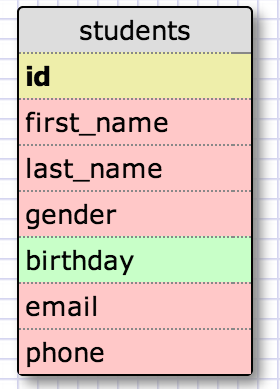
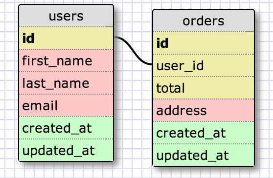
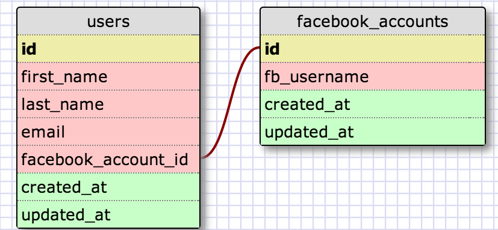
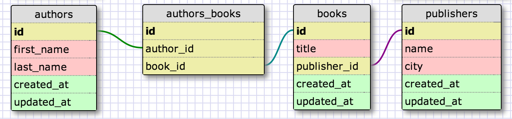
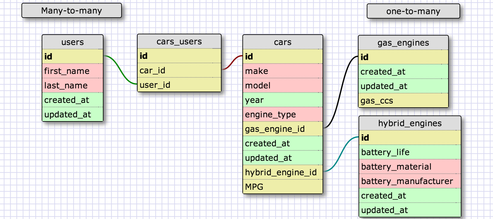

# U3.W7: Designing Schemas

#### I worked on this challenge with C.J. Jameson

## Release 0: Student Roster Schema

* * * 

## Release 1: One to Many Schema
<!-- display your image inline here -->

* * * 
## Release 2: One to One Schema
<!-- display your image inline here -->

* * * 
## Release 3: Many to Many Schema
<!-- display your image inline here -->

* * *
## Release 4: Design your own Schema
Description of what you're modeling: 
* We modeled the database relationship between cars and different types of engines
<!-- display your one-to-one image inline here -->
<!-- display your many-to-many image inline here -->

* * * 
## Release 5: Reflection
* For this challenge, I ended up pairing with C.J., and it was a great decision. I felt like having someone else there to work through the database relationships was a great help because we could both look at it from different angles and decide where to go from there. It was a bit hard to see the relationships between different tables, but we made sense of it after a little while. Our strategy was mainly to create our fields based on the instructions and then figure out how each table was related to the other, and then added foreign keys. It worked well and we ended up getting through the challenge. Overall, I feel comfortable with the learning objectives and can't wait to get into more SQL!