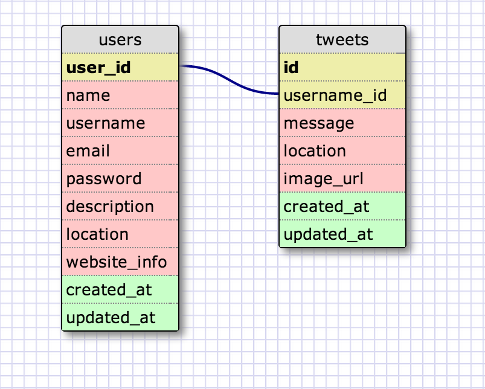

# U3.W7: Modeling a Real-World Database (SOLO CHALLENGE)

## Release 0: Users Fields
 * Fields:
 	* user_id
 	* Name
 	* Username
 	* email address
 	* password
 	* Description
 	* Location
 	* Website info

## Release 1: Tweet Fields
 * Fields:
 	* id
 	* username_id
 	* message
 	* image url
 	* location

## Release 2: Explain the relationship
The relationship between `users` and `tweets` is: 
One-to-Many, because each user can have many tweets, but each tweet can only belong to one user, and many users cannot author the same tweet.

## Release 3: Schema Design

## Release 4: SQL Statements
<!-- Include your SQL Statements. How can you make markdown files show blocks of code? -->
* all the tweets for a certain user id:  
`SELECT message   
FROM users JOIN tweets ON user_id = username_id    
WHERE user_id = 241524`   
(chose arbitrary integer for user_id)  

* * *

* the tweets for a certain user id that were made after last Wednesday (whenever last Wednesday was for you)  
`SELECT message  
FROM users JOIN tweets ON user_id = username_id  
WHERE user_id = 241524 AND tweets.created_at > '2014/04/23'`   

* * *

* all the tweets associated with a given user's twitter handle:  
`SELECT message  
FROM users JOIN tweets ON user_id = username_id  
WHERE username = '@JacobPersing'`  

* * *

* the twitter handle associated with a given tweet id:  
`SELECT username   
FROM users JOIN tweets ON user_id = username_id   
WHERE tweets.id = 123456 (chose arbitrary integer for tweet id)`   

* * * 

## Release 5: Reflection
* For this solo challenge, it was great to get some experience with modeling database relationships for a real website, and how they would be used to access data. I found it somewhat difficult to find out exactly which fields were stored by twitter, but I think I got most of the important values. I'm still struggling a bit with the different database relationships, but I'm getting the hang of it and I think I just need some more practice. This week's challenges are the first I've done with SQL before, so I'm sure I just need to keep at it and I'll get better at it. Overall I feel pretty comfortable with using select queries and joins, and didn't really find any part of this challenge to be tedious because I am learning a lot of useful information. 
